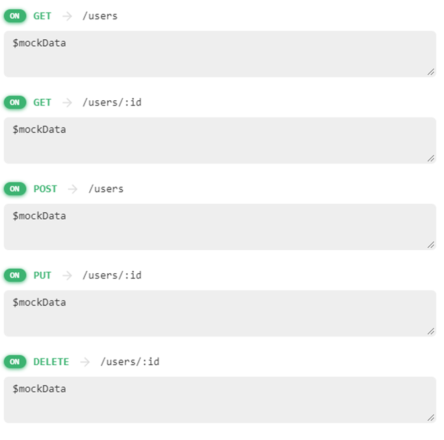

# React Code Challenge — Agrak

Using the provided project structure and the provided API, create a simple web application that allows to manage a list
of users.

## Details

You will need to build the following views with React

#### Home View

Which must contain:

- A list of users showing their first_name, second_name, email, avatar
- A button to add a new user (this button should redirect to the user creation view)
- A button to edit an existing user (this button should redirect to the user edition view)
- A button to delete an existing user (this button should delete the user and refresh the list)

#### Create User View/Update User View

Which must contain:

- A form to create a new user or update an existing user
- A button to save the user (this button should save the user and redirect to the home view)
- A button to cancel the action (this button should redirect to the home view)
- A button to delete the user (only in the update view) (this button should delete the user and redirect to the home
  view)
- A button to go back to the home view
- The form must have the following fields:
    - first_name
    - second_name
    - email
    - avatar

## Technical details

We will not evaluate the design of the application, but we will evaluate the code quality, so we suggest to follow
software engineering best practices that demonstrate that you are able to develop high-quality software.

- You *must* use Typescript
- You can use any CSS framework you want
- You *must* use React Query as a State management library
- You can use any routing library you want
- You can use any HTTP client library you want

#### Functional requirements

- You will have to configure routes to navigate between the views and to be able to access them directly by the URL.
- You will have to use the provided API to fetch the users and to create/update/delete them.
- Any updates to the users must be reflected in the home view.

## Api

The API endpoint is [Api user](https://635017b9df22c2af7b630c3e.mockapi.io/api/v1/users).

## Delivery

The only deliverable is a link to a public repository with the code of the application. You can use any repository
hosting service you want (Github, Gitlab, Bitbucket, etc.)

### Feel free to edit this README file to add any information you consider relevant to the solution.
